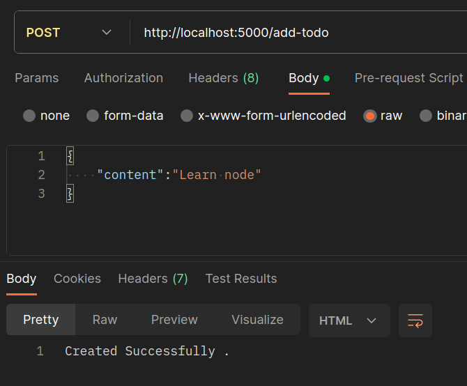

# API
API (Application Programming Interface) is a set of rules and protocols that allows one software application to communicate and interact with another. It serves as a bridge, defining how requests for services or data should be made and how responses are structured. APIs enable different software systems to work together, providing a standardized way for them to exchange information and functionality.

Let's understand , with a real-life example involving a chef, a customer (client), and a menu:

- Chef:
    The chef represents the server-side functionality. In a restaurant setting, this is the person responsible for preparing and cooking the food.

- Customer (Client):
    The customer represents the client-side functionality. In a restaurant, this is the person who wants to order food from the menu.

- Menu:
    The menu represents the API, acting as the set of options and rules that define how a customer can request specific dishes from the chef.

In this analogy:

- The menu serves as a predefined set of options and rules, similar to an API that defines how a customer can interact with the chef (server).<br/>
- The customer is the client, interacting with the menu (API) to place an order.<br/>
- The chef represents the server, processing the order based on the rules defined by the menu (API).<br/>


Server-Side (Backend):

Assume there's a server that holds user information and provides it through a simple API.

    API Endpoint: /api/user/:userId
    Sample Server Response:
    User ID: 123
    Username: john_doe
    Email: john@example.com

Client-Side (Frontend): 

if a client makes a request to the specified API endpoint (/api/user/123), the server would respond with the user information. The response might look like this:

    User ID: 123
    Username: john_doe
    Email: john@example.com
## Types of API's

APIs can be categorized into different types based on their design, purpose, and how they are used. Here are some common types of APIs:
- Library APIs : These APIs provide pre-built code libraries or functions that developers can use in their applications. Library APIs are often specific to a particular programming language or framework.
- HTTP APIs (or Web api's) : are a type of API that uses the HTTP (Hypertext Transfer Protocol) as the communication protocol. These APIs are commonly used for web development and are accessible over the internet.

## HTTP API's

- GraphQL
- Rest API
...

## REST API :
RESTful APIs are a popular type of HTTP API that follows the principles of Representational State Transfer (REST). They use standard HTTP methods (GET, POST, PUT, DELETE) to perform operations on resources, and they often use JSON as the data format. RESTful APIs are known for their simplicity, scalability, and statelessness.<br/>


# Demo
In this section, we will create our first APIs and develop a simple to-do app using Express.
First, we will create a file named 'Data.json.' This file will contain a list of our todos, where each todo has an id, content, and isCompleted field to indicate whether a todo is completed or not.
```
[
    {
      "id": 1,
      "content": "Buy groceries",
      "isCompleted": false
    },
    {
      "id": 2,
      "content": "Finish work report",
      "isCompleted": true
    },
    {
      "id": 3,
      "content": "Exercise for 30 minutes",
      "isCompleted": false
    },
    {
      "id": 4,
      "content": "Read a book",
      "isCompleted": false
    }
]
```
Next, open your terminal and run the command npm init -y. This initializes a new Node.js project and creates a 'package.json' file with default settings. The 'package.json' file is crucial for managing project details and dependencies.
```
npm init -y
```
After initializing your Node.js project, install Express by running the command:
```
npm install express
```
To enable automatic server refreshing, install nodemon by running the command:
```
npm install nodemon
```
Nodemon monitors changes in your project and automatically restarts the server when it detects modifications, streamlining the development process.

After installing Express and nodemon, you'll notice that your 'package.json' file has been automatically updated to include these dependencies. This file keeps track of project details and dependencies, helping you manage your Node.js application effectively.


Now, update the 'scripts' section in your 'package.json' file by adding the following line:
```
"scripts": {
  "start": "nodemon server.js"
}
```

This allows you to execute the server using nodemon by running the command npm start. Nodemon will automatically monitor changes and restart the server as needed.

Now, we are prepared to create our server. First, generate a file named "server.js" and insert the following code:
    // File: server.js

    // Importing the Express.js library
    const express = require('express');

    // Importing data from the 'data.json' file
    let todos = require('./data.json');

    // Creating an instance of the Express application
    const app = express();

    // Setting up the server to listen on port 5000
    app.listen(5000, () => {
        console.log("Listening on port 5000");
    });

to start our server open terminal and execute this command 
```
npm start
```
You should see this message displayed in the terminal:<br/>
<br/>
Now, let's create our first API endpoint. It will be responsible for returning the list of todos
For the client, we will retrieve data from the server, so we will use the GET method.

```
const express = require('express');

const app = express();

// API endpoint for handling GET requests at the '/todos' routes :
app.get('/todos',(req,res)=>{
    res.json(todos)
})

app.listen(8083, () => {
    console.log("Listening on port 8083");
});
```
This code defines an API endpoint for handling GET requests at the '/todos' route. When a client makes a GET request to this API endpoint, the server responds by sending a JSON representation of the 'todos' data back to the client. <br/>

Now, if we use Postman to make a GET request to '/todos', we should expect to see the list of todos displayed in the response.<br/>
<br/>

After returning the list of todos, it's time to add some new ones. To achieve this, the client will send data to the server. Consequently, the endpoint will be responsible for handling POST requests originating from the client

```
// some code
app.post('/add-todo',(req,res)=>{
    let newTodo = {
        "id":todos.at(-1).id +1,
        "content":req.body.content,
        "isCompleted":false
    }

    todos.push(newTodo)
    res.send("Created Successfully .")
})
// some code
```
This line sets up a route for handling HTTP POST requests at the '/add-todo' endpoint. The callback function (req, res) => {...} will be executed when a POST request is made to this endpoint.
```
app.post('/add-todo', (req, res) => {...}
```

The code creates a new todo object (newTodo).<br/>
The expression todos.at(-1).id + 1 retrieves the id of the last todo and increments it by 1.<br/>
The 'content' is set to the value sent in the request body under the 'content' property (req.body.content).<br/>
'isCompleted' is initially set to false.<br/>

```
let newTodo = {
    "id": todos.at(-1).id + 1,
    "content": req.body.content,
    "isCompleted": false
};
```

The newly created todo (newTodo) is added to the 'todos' array using the push method.
```
todos.push(newTodo);
```
The server responds to the client with the text "Created Successfully." This indicates that the todo creation was successful.
```
res.send("Created Successfully.");
```

Don't forget to use the middleware express.json(). This middleware is responsible for parsing incoming JSON data in the request body , so when a client sends data to the server in a POST or PUT request, the data is often included in the request body. If the data is in JSON format (common for APIs), express.json() parses this JSON data and transforms it into a JavaScript object. This parsed data is then made available in the req.body object, allowing the server to easily work with the data .

```
const express = require('express');
let todos = require('./data.json');
const app = express();

// add this line
app.use(express.json())

// some code
```


In summary, when a client makes a POST request to '/add-todo' and includes a JSON payload with a 'content' property, the server creates a new todo, adds it to the 'todos' array, and responds with "Created Successfully"<br/>
<br/>

The final endpoint is designated for deleting a todo, and for this purpose, we will use the DELETE method, similar to the GET method, as it does not have a request body. To specify the todo to be deleted, we will pass its id in the URL. This approach is commonly referred to as using URL parameters.

```
// Endpoint for handling DELETE requests to delete a todo by its ID

app.delete('/todo/:id', (req, res) => {

    // Using the 'filter' method to create a new array excluding the todo with the specified ID

    todos = todos.filter((todo) => {
        return todo.id != req.params.id;
    });

    // Sending a response indicating successful deletion
    res.send("Deleted Successfully");
});
```
Let's break down the concepts of /todo/:id and req.params : <br/>
:id in the Route:

- /todo/:id is a route pattern in Express.js.
- The colon (:) indicates a URL parameter, and in this case, it's named id.
- This means that when a client makes a request to a URL matching this pattern, the actual value provided for id in the URL will be captured and made available for use in the route handler.

req.params:<br/>

- In Express.js, req.params is an object that contains properties mapped to the named route parameters.
- In the case of /todo/:id, when a client makes a request to, for example, /todo/123, the value 123 would be    accessible in req.params.id.
- req.params allows you to access the values of URL parameters specified in the route.

If we want to delete todo number 2, we should make a DELETE request and specify in the URL '/todo/2'<br/>
<br/>
To verify whether the todo has been deleted, we can use the previously created GET request<br/>
<br/>
The final addition will be a middleware to verify whether a todo already exists or not. To achieve this, we will incorporate the following function:

```
// Middleware function to verify if a todo already exists
const verify = (req, res, next) => {
    // Extracting the content of the new todo from the request body
    let newTodo = req.body.content;

    // Checking if a todo with the same content already exists in the 'todos' array
    let result = todos.find((todo) => {
        return todo.content == newTodo;
    });

    // If a todo with the same content already exists, send a response indicating it
    if (result) {
        res.send("Already exist");
    } else {
        // If the todo does not exist, proceed to the next middleware  
        next();
    }
};
```
We need to update the code for the POST request responsible for adding a new todo. To do this, we should incorporate the verify middleware just before the function that handles the addition of a new todo.<br/>
```
// some code

// Modified code for the POST request to add a new todo
app.post('/add-todo', verify, (req, res) => {

    let newTodo = {
        "id": todos.at(-1).id + 1,
        "content": req.body.content,
        "isCompleted": false
    };

    todos.push(newTodo);

    res.send("Created Successfully.");
});

// some code
```
Now, if we attempt to add a todo with the content 'Buy groceries', which already exists in the list, the server should respond with 'Already exist'.<br/>
<br/>
